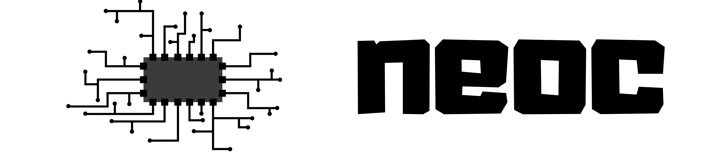
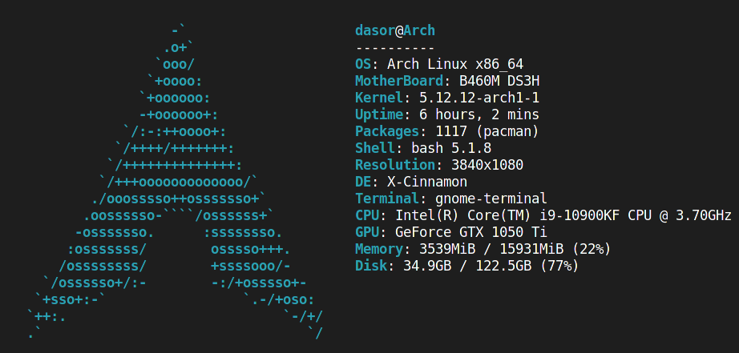
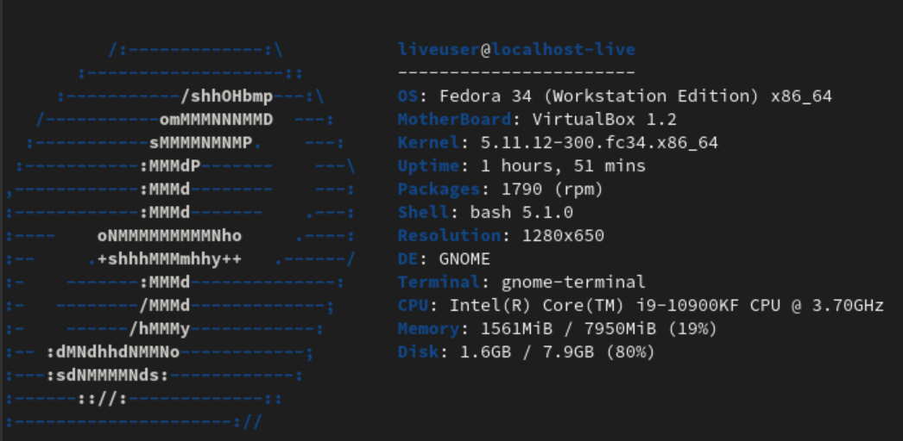
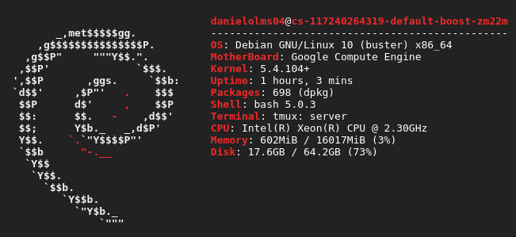
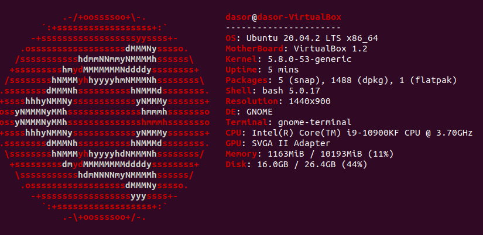

<p align="center"></p>

<div align="center">
<h4 align="center">neofetch written in c</h4>

&nbsp;

<p align="center"></p>


</div>

# 1. Introduction
neoc is a fairly simple program made by a future cs college student just to practice his c skills. It is better than neofetch in a couple of things, firstly it is faster and secondly it also displays disk info.

It also has some downsides, neoc doesn't show any theme related info it just shows the desktop enviroment. Also neoc is missing some logos as well as some package managers that will be added as soon as possible but trying to keep the programn as fast as posible. Lastly, neoc only works on linux.

# 2. Installating libraries
To run neoc you will need 2 libraries libx11 and libpci so this are some examples on how to install them.
for red hat based distros:

  ```bash
  sudo yum install pciutils-devel
  sudo yum install libX11-devel.x86_64
  ```
  or
  ```bash
  sudo yum install libX11-devel.i686
  ```
for debian based distros:
  ```bash
  sudo apt install libx11-dev
  sudo apt install libpci-dev
  ```
And for Arch based distros:

  ```bash
  sudo pacman -S libx11
  sudo pacman -S libpciaccess
  ```

# 3. Examples
Here are more examples of how `neoc` looks on different `PC's`.

<p align="center"></p>

<p align="center"></p>

<p align="center"></p>


# 4. Bugs or improvements
There are probably many bugs that I'm not aware of so, if you find any bug or think of any improment feel free to open a pull request.

I would like to thank [DrNoob](https://github.com/Dr-Noob) for his help, running `neoc` in many different PC's he has access to, which makes it easier to debug and check the correctness of `neoc` he also made many suggestions and helped me with some topics I did not have any idea about .
